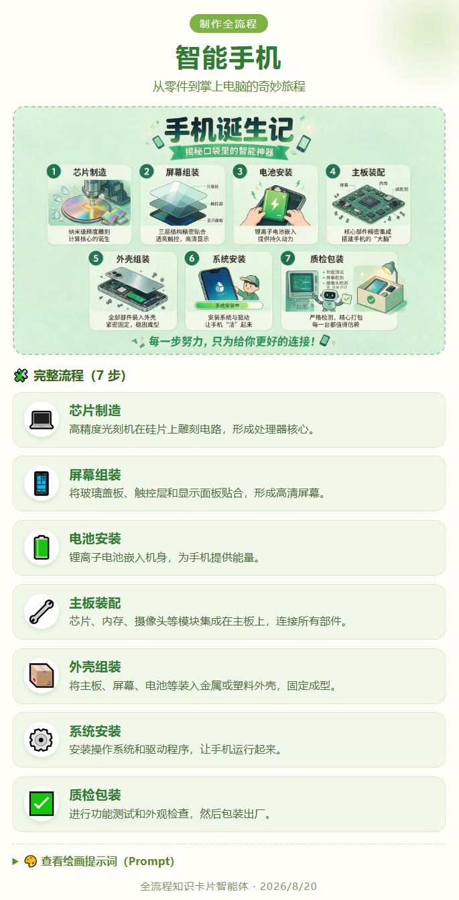
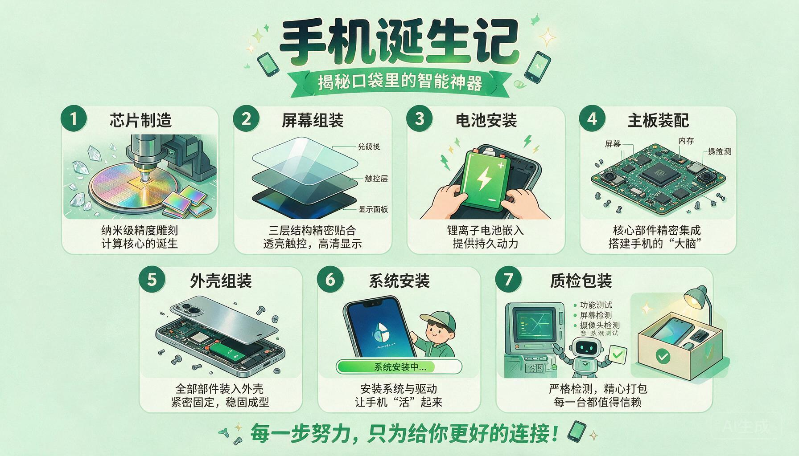

# 全流程知识卡片 · 智能体

输入一个主题，生成一张**「制作全流程」风格的科普知识卡片**：扁平风插画（浅绿背景、卡通简约）+ 分步骤的图标 + 文字讲解，把「它是怎么从原料到成品的」讲得清清楚楚。

> 由扣子(Coze)工作流「全流程的风格 / 制作全流程」转换而来。原工作流的大模型 systemPrompt 已精炼为 `QUANLIUCHENG_SYSTEM` 常量。

## 界面预览

**全流程操作界面**



**示例主题：智能手机（生成效果）**



> 更多示例与可交互演示见 [`demo/`](demo/) 目录：`智能手机.html`（完整卡片页面）、`全流程界面-1.png`、`智能手机-1.png`（高清截图）。

## 快速开始

1. 确保已安装 [Node.js](https://nodejs.org)（LTS 版，勾选 Add to PATH）
2. 双击 `启动.bat`，浏览器自动打开 `http://127.0.0.1:8790`
3. 点击右上角 ⚙ 设置，填入你的 LLM API Key（可选填图像模型）
4. 输入主题（如「绿茶」「豆腐」「纸张」），点击「开始生成」

> 未配置图模型也能用：会生成包含分步图标文字与完整绘画 Prompt 的步骤卡片，可复制到豆包 / 即梦 / 通义万相等工具继续绘图。

## 配置说明

复制 `.env.example` 为 `.env`，填入你的 API Key：

```env
LLM_BASE_URL="https://api.deepseek.com/v1"
LLM_API_KEY="sk-你的Key"
LLM_MODEL="deepseek-chat"

# 图像模型可选，留空则仅生成步骤卡片 / Prompt
IMG_BASE_URL=""
IMG_API_KEY=""
IMG_MODEL=""
IMG_SIZE="1792x1024"
```

支持 DeepSeek、通义千问、智谱、Kimi、OpenAI 等 OpenAI 兼容接口的 LLM，以及 OpenAI、硅基流动、通义万相、火山方舟等图模型。

## 文件结构

```
全流程知识卡片智能体/
├── 启动.bat              # 主启动器（自动探测 Node）
├── 启动.vbs              # 备用启动器
├── 修复bat关联.reg        # 修复 .bat 文件关联
├── server.js             # 零依赖 Node 后端
├── index.html            # 前端页面
├── css/styles.css        # 浅绿卡通主题样式
├── js/app.js             # 前端逻辑
├── .env.example          # 配置模板（不含真实 Key）
├── 使用说明.md            # 详细使用说明
├── SKILL.md              # 技能元信息
└── output/               # 生成的卡片存放目录
```

## 功能特点

- **全流程拆解**：LLM 把主题拆成 3~8 个有序步骤，每步配 emoji 图标 + 一句话说明
- **AI 插画**：调用图模型生成扁平风、浅绿背景、卡通简约的流程插画
- **文案模式**：未配图像模型时生成完整 Prompt，方便二次创作
- **自包含展示页**：生成的 HTML 单文件，离线可看、可打印、可转发

## 来源

由扣子(Coze)工作流「全流程的风格 / 制作全流程」转换而来。
